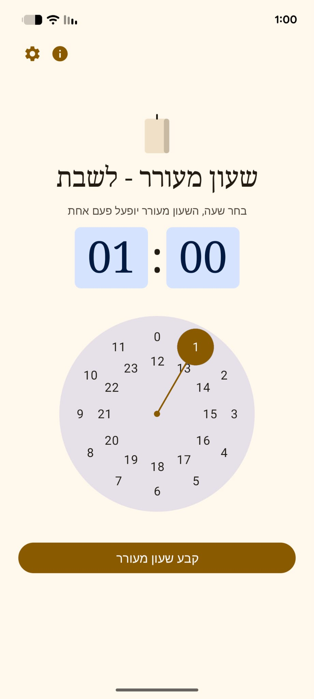
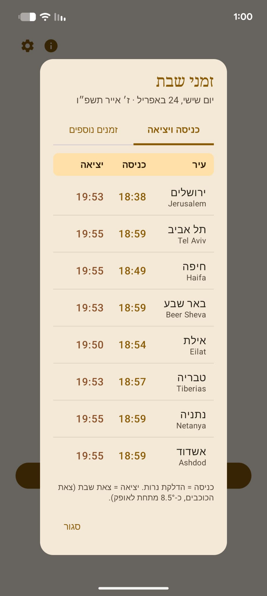
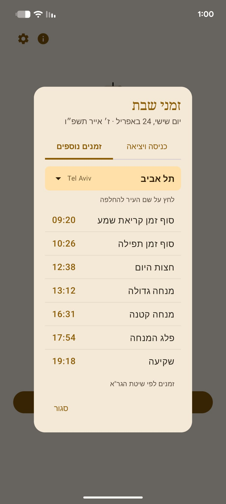
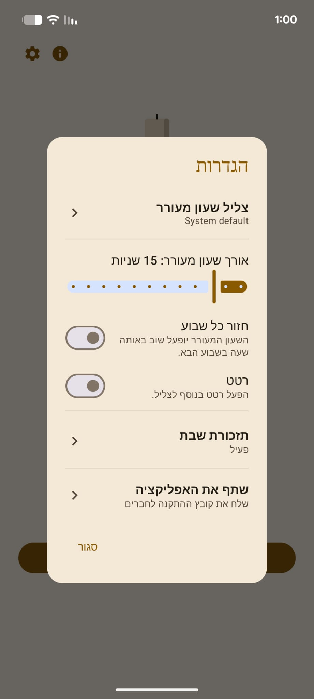

<div align="center">

# 🕯️ שעון מעורר — לשבת

### **Shabbat Alarm**

_A minimalist, Hebrew-first Android alarm — built for the one day a week you don't want to touch your phone._

<br>

[](https://developer.android.com)
[](https://kotlinlang.org)
[](https://developer.android.com/jetpack/compose)
[](https://github.com/KosherJava/zmanim)

<br>

**[📸 Screenshots](#-screenshots)** · **[✨ Features](#-features)** · **[📥 Install](#-installation)** · **[🏗 Architecture](#-architecture)** · **[🛠 Build](#-building-from-source)**

</div>

<br>

---

## 🎯 Why another alarm app?

Weekday alarm apps are built around interaction — snooze, dismiss, swipe, tap. **Shabbat is the opposite.** You set the alarm Friday afternoon, and from that moment you shouldn't touch the phone.

This app is built around a single promise:

> **Set once. Fires once. Plays for exactly N seconds. Stops itself. Never asks you to interact.**

No snooze. No dismiss. No lingering notification to swipe away. Just a gentle reminder that respects Shabbat — and fires reliably even from Doze mode.

<br>

---

## 📸 Screenshots

<div align="center">

<div dir="ltr">
<table>
<tr>
<td align="center" width="25%"></td>
<td align="center" width="25%"></td>
<td align="center" width="25%"></td>
<td align="center" width="25%"></td>
</tr>
<tr>
<td align="center"><sub><b>🏠 מסך ראשי</b><br/>בוחרים שעה — ומסיימים</sub></td>
<td align="center"><sub><b>🕯️ זמני כניסה ויציאה</b><br/>8 ערים בישראל</sub></td>
<td align="center"><sub><b>📜 זמנים נוספים</b><br/>סוף זמן שמע, פלג המנחה…</sub></td>
<td align="center"><sub><b>⚙️ הגדרות</b><br/>צליל, רטט, תזכורות</sub></td>
</tr>
</table>
</div>

</div>

<br>

---

## ✨ Features

<table>
<tr>
<td width="50%" valign="top">

### 🕯 Core alarm
- Up to **5 concurrent alarms** (הדלקת נרות + הבדלה + ...)
- **Adjustable duration** 5–60s (default 15s)
- **One-shot or weekly** — per alarm
- Plays on the **ALARM audio stream** — respects system volume
- **Fade-in** — gentle wake
- **Optional vibration**

### 📅 Shabbat times
- **8 Israeli cities** with accurate candle-lighting + Havdalah
- **Hebrew dates** (`ז׳ באייר התשפ״ו`)
- **Advanced zmanim** — Sof Zman Shma, Mincha Gedola/Ketana, Plag, שקיעה
- **Automatic Yom Tov detection** — switches to holiday times
- **Pre-Shabbat reminder** — 40 min before candle lighting

</td>
<td width="50%" valign="top">

### 🎨 Design
- **Hebrew-first, full RTL** layout
- **Custom Shabbat palette** — warm gold + deep navy
- **Animated candle** that flickers when an alarm is armed
- **Hand-designed icon** with gradients + warm halo
- **Light + Dark mode** (follows system)
- **Home screen widget** — next alarm always in sight

### 🔒 Reliability
- **Doze-mode resilient** — `setExactAndAllowWhileIdle`
- **Partial WakeLock** — CPU stays awake during playback
- **Reboot recovery** — alarms survive restart
- **Self-healing weekly alarms** — catches up after days offline
- **Battery-optimization warning** — detects and nudges you to fix

### 🎵 Personalization
- **Pick any audio file** from the phone (up to 10 custom tones)
- **System ringtones** with 5-second preview
- **Share the APK** to friends straight from Settings

</td>
</tr>
</table>

<br>

---

## 📲 Installation

### Quick install (end users)

> 🔗 **[Download ShabbatAlarm.apk](https://github.com/MaozEpsein/Shabbat-Alarm/releases/latest/download/ShabbatAlarm.apk)**
> _Debug build · ~10 MB · Android 8.0+_

<details>
<summary><b>📖 First-time installation walkthrough</b></summary>

1. Open the `.apk` file on your phone (from Downloads or WhatsApp)
2. Android will warn "**Untrusted source**" — tap **Settings** → enable **Allow from this source**
3. If **Google Play Protect** shows "Unsafe app blocked" — tap **More details** → **Install anyway**
   (the app is unsigned by Google, not malicious — you can verify the source on this repo)
4. Tap **Install**
5. On first launch, grant:
   - 🔔 **Notifications** — so you see the alarm
   - ⏰ **Exact alarms** — so it fires on time
6. In **Settings → Apps → Shabbat Alarm → Battery**, disable battery optimization
   (or tap **"Fix now"** on the in-app warning card)

</details>

### Alternative: get it from a friend

Anyone who has the app can share it via **⚙️ Settings → "שתף את האפליקציה"** — Android's share sheet opens and the APK goes out through WhatsApp, Drive, or email.

<br>

---

## 🏗 Architecture

<div align="center">

| Layer | Choice |
|:---:|:---|
| **Language** | Kotlin 2.0 |
| **UI** | Jetpack Compose + Material 3 |
| **Scheduling** | `AlarmManager.setExactAndAllowWhileIdle` |
| **Playback** | `MediaPlayer` on `USAGE_ALARM` stream |
| **Reliability** | `PARTIAL_WAKE_LOCK` + Foreground Service |
| **Shabbat math** | [KosherJava](https://github.com/KosherJava/zmanim) 2.5.0 |
| **Storage** | SharedPreferences + JSON |
| **Concurrency** | Kotlin Coroutines |
| **Min / Target SDK** | 26 (Android 8) / 34 (Android 14) |

</div>

### Alarm flow

```
MainActivity (Compose UI)
         ↓ user sets alarm
AlarmScheduler → AlarmManager.setExactAndAllowWhileIdle(triggerMillis, PendingIntent)
         ↓ (at trigger time)
AlarmReceiver → acquire PARTIAL_WAKE_LOCK → startForegroundService(…)
         ↓                                     ↓
  (reschedule weekly)                    AlarmService
                                               ↓
                                     MediaPlayer + vibration
                                     + fade-in + N-sec Coroutine
                                               ↓
                                     stopSelf() → release WakeLock
                                               ↓
                                     ShabbatAlarmWidget.updateAll()
```

<br>

---

## 📁 Project structure

<details>
<summary><b>Click to expand</b></summary>

```
app/src/main/java/com/example/shabbatalarm/
├── MainActivity.kt                  · Compose entry point, forces RTL
├── ShabbatAlarmApp.kt               · Application, creates notification channels
│
├── alarm/
│   ├── AlarmRepository.kt           · SharedPreferences — alarm list, settings,
│   │                                  custom tones (with migration from v1)
│   ├── AlarmScheduler.kt            · AlarmManager wrapper (per-alarm IDs)
│   ├── AlarmReceiver.kt             · Catches alarm fire, reschedules weekly
│   ├── AlarmService.kt              · Foreground service — playback + vibration
│   ├── AlarmWakeLock.kt             · PARTIAL_WAKE_LOCK singleton
│   ├── AlarmTones.kt                · System ringtones + user's custom tones
│   ├── BootReceiver.kt              · Restores alarms after reboot
│   ├── ShabbatTimes.kt              · Shabbat + holiday times + Hebrew dates
│   ├── ShabbatReminderScheduler.kt  · Weekly Jerusalem-anchored reminder
│   └── ShabbatReminderReceiver.kt   · 40-min-before notification
│
├── ui/
│   ├── AlarmScreen.kt               · Main screen — TimePicker + list
│   ├── AnimatedCandle.kt            · Canvas drawing with flicker animation
│   ├── ShabbatTimesDialog.kt        · Two tabs: times + advanced zmanim
│   ├── SettingsDialog.kt            · Sub-views: sound picker, reminder
│   ├── BatteryOptimizationCard.kt   · Warning card
│   ├── TonePreview.kt               · 5-second audio preview
│   ├── ApkSharer.kt                 · FileProvider + Intent.ACTION_SEND
│   └── theme/                       · Color, Typography, Theme
│
└── widget/
    └── ShabbatAlarmWidget.kt        · Home screen widget provider
```

</details>

### Manifest permissions

| Permission | Purpose |
|---|---|
| `SCHEDULE_EXACT_ALARM`, `USE_EXACT_ALARM` | Exact alarms on API 31+ |
| `FOREGROUND_SERVICE`, `FOREGROUND_SERVICE_MEDIA_PLAYBACK` | Playback service |
| `WAKE_LOCK` | Keep CPU awake during playback |
| `RECEIVE_BOOT_COMPLETED` | Re-arm alarms after reboot |
| `POST_NOTIFICATIONS` | Display alarm & reminder notifications |
| `REQUEST_IGNORE_BATTERY_OPTIMIZATIONS` | Bypass Doze restrictions |
| `VIBRATE` | Optional vibration |

<br>

---

## 🛠 Building from source

### Requirements

- **Android Studio** Ladybug (2024.2) or newer
- **JDK 17**
- **Android SDK** with API 34

### Clone and run

```bash
git clone <your-repo-url>
cd shabat-alarm

# Open in Android Studio — Gradle sync runs automatically.
# Then press Run ▶
```

### Build an APK for distribution

```
Build → Build Bundle(s) / APK(s) → Build APK(s)
```

Output: `app/build/outputs/apk/debug/app-debug.apk`

<br>

---

## 🙏 Acknowledgments

- **[KosherJava](https://github.com/KosherJava/zmanim)** — the astronomical calculations for candle lighting and Havdalah times. The gold standard for Jewish calendar math.
- **Google Material Design** — color system, typography, and Compose components.
- Built collaboratively with **Claude** (Anthropic) in **Cursor**, deployed through **Android Studio**.

<br>

---

## 📄 License

Personal project · Not for commercial distribution.
**KosherJava** is used under its LGPL license.

<br>

<div align="center">

_Built with ❤️ for Shabbat_

**[⬆ Back to top](#️-שעון-מעורר--לשבת)**

</div>
